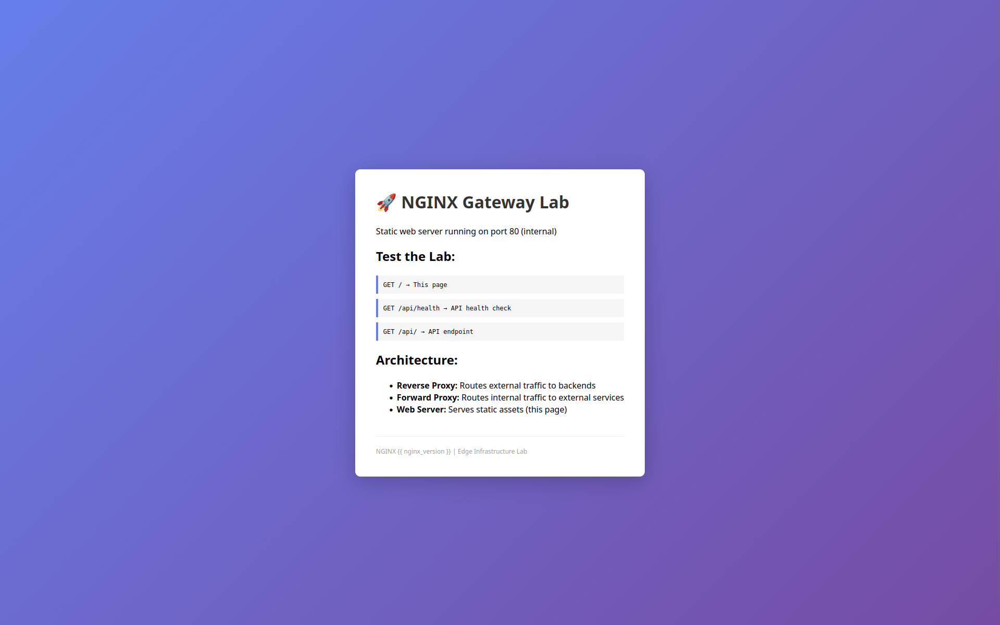

# Web Server

Simple static HTTP server serving HTML/CSS/JS assets.

## Preview



The static page displays:

- Lab title and description
- Test endpoint links
- Architecture overview (Reverse Proxy, Forward Proxy, Web Server)
- NGINX version footer

## Build & Run

```bash
# Build the image
docker build -t nginx-web:latest .

# Remove any existing container with the same name
sudo docker rm -f web

# Run the container
docker run -d -p 8080:80 --name web nginx-web:latest
```
